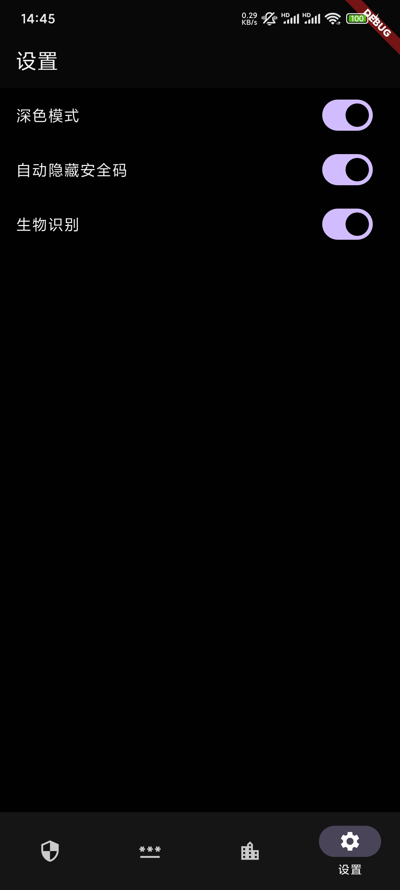

# FlAuth

FlAuth是一个使用Flutter技术写的身份验证系统系统，简单易用。

起因是前几天看到微软要停用Microsoft Authenticator，但是我自己的两步验证密码都保存在Microsoft Authenticator上。没办法，就去找新的验证器。

谷歌play上下载了几个试用了下，感觉都不是很满意，索性就自己写一个吧。

基本功能应该都有，主要还是两步验证。仿照Microsoft Authenticator也写了密码和地址模块。算是能用级别

状态管理用的是[GetX](https://github.com/jonataslaw/getx/blob/master/README.zh-cn.md) 。只会用这个，其他的不会。

totp扫码和文件添加只能用未加密的数据，没做加密数据解析。

地址文件只支持浏览器导出的csv文件，其他的没试

要求不多，反正也是自己用用。

图标是豆包AI画的。

## 截图

## 黑暗模式

